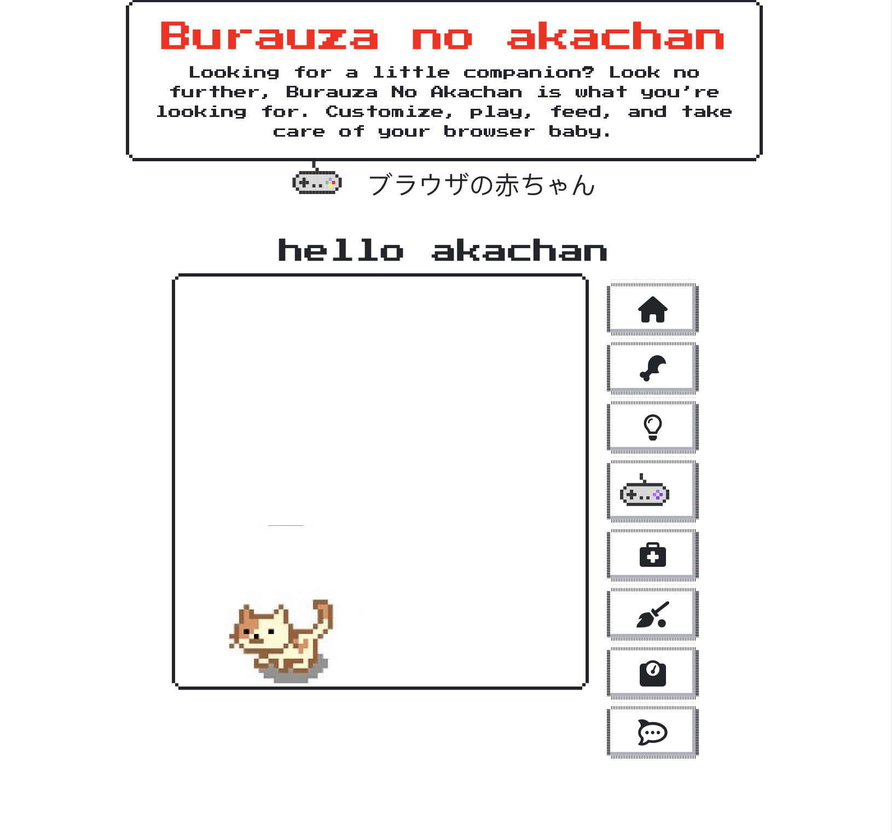

# gp-mini-pet
A virtual mini pet game

https://monacoglynn.github.io/gp-mini-pet/

### project title Burauza no Akachan (Browser Babies)

Authors: Hai, Marshall, Patrick, & Richmond
Project Title: Burauza No Akachan (Browser Babies)
Project Description: Create a virtual pet to take care of and watch it grow!
User story: Looking for a little companion? Look no further, Burauza No Akachan is what you're looking for. Customize, play, feed, and take care of your browser baby.
APIs: moment.js, kanye.rest
Rough Breakdown
    Marshall: sprite animation
    Hai: Logic JS
    Richmond: html/nes.css
    Patrick: admin and helping with anything else.

# description

Burauza no Akachan is a virtual pet you take care of directly in your browser. Name your pet, feed them and clean up after them, your akachan is just like owning a real pet.

# user story

You've been wanting a pet, but you don't have the time or money. You also grew up in the 90's and remember those awesome key chains Tomagatchi! You are taking the bus home and see an ad for Burauza no Akachan and are intrigued.  It is a free app that lets you create your very own virtual pet.

### Future Direction

In the future we hope to create more sprites to give users more options of their Burazua no Akachan to give a more personalized game for each user. The idea of having the babies grow and change is also on the horizon.

